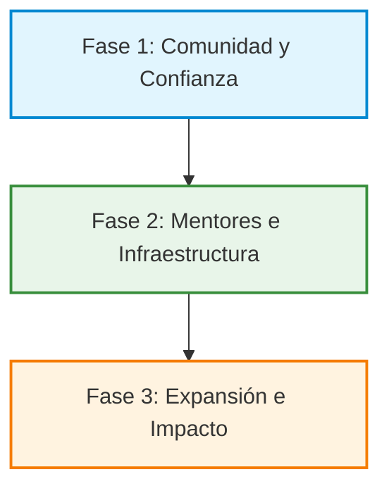

# 03. Plan Operativo y Roadmap: La Hoja de Ruta de Fadeem

Para llevar a Fadeem de una idea a una organización en funcionamiento, definimos etapas claras basadas en el crecimiento de la confianza y la estructura operativa.

---

## 🗺️ Roadmap de Crecimiento

### 📈 Fase 1: Cimentación (Comunidad y Confianza)
*Foco: Construcción de comunidad activa, validación de necesidades y soporte práctico básico. Esta fase avanza de acuerdo a la madurez de los participantes, respetando sus propios tiempos.*

* **Objetivo 1: Construir una comunidad activa de emprendedores.**
  * *Acción:* Lanzamiento de canales digitales de costo cero (grupo de WhatsApp interactivo de Fadeem, enfocado inicialmente en Jardín América y la provincia de Misiones).
  * *Acción:* Dinámicas semanales virtuales de interacción (Lunes de Presentación, Miércoles de Alianzas, Viernes de Logros).
  * *Métrica de éxito:* Consolidación de un núcleo de miembros activos compartiendo y resolviendo dudas de manera habitual.
* **Objetivo 2: Lanzar espacios de soporte práctico sin intermediación física.**
  * *Acción:* Desarrollar las primeras guías prácticas de libre acceso basadas en herramientas de código abierto.
  * *Acción:* Ofrecer las primeras **"Clínicas de Diagnóstico Exprés"**: talleres breves de 45 minutos online para resolver problemáticas inmediatas (ej: orden y registro básico de gastos personales vs. negocio).

---

### 📈 Fase 2: Consolidación (Mentores e Infraestructura de Contenido)
*Foco: Estructuración de la red de mentores ad-honorem y desarrollo de la Caja de Herramientas con recursos open-source.*

* **Objetivo 1: Incorporar mentores con experiencia real y espíritu voluntario.**
  * *Acción:* Identificar y convocar a emprendedores consolidados de Jardín América y de la provincia de Misiones que quieran donar horas de consultoría y mentoría 1-a-1 de igual a igual.
  * *Acción:* Crear el *Manual del Mentor Fadeem* para establecer el tono de acompañamiento empático y orientado a la acción.
* **Objetivo 2: Desarrollar la Caja de Herramientas de libre acceso.**
  * *Acción:* Desarrollar plantillas financieras simplificadas (Excel/Calc de costos y precios de equilibrio) y check-lists de organización comercial, utilizando únicamente software libre.
  * *Acción:* Dictar "Clínicas de Diagnóstico" orientadas a enseñar la implementación de la planilla de costos y fijación de precios en el negocio del participante.
* **Objetivo 3: Mantener sustentabilidad operativa financiera cero.**
  * *Acción:* Asegurar que el soporte e infraestructura sigan alojándose en plataformas gratuitas y mantenidos a través del esfuerzo ad-honorem del equipo.

---

### 📈 Fase 3: Expansión (Alianzas y Escala Nacional)
*Foco: Posicionamiento institucional y alcance federal de libre acceso.*

* **Objetivo 1: Consolidar la red en Misiones y proyectar el impacto nacional.**
  * *Acción:* Articular convenios de colaboración con el municipio de Jardín América, otras comunas locales y cámaras de comercio de la provincia.
  * *Acción:* Adaptar los recursos de capacitación y la comunidad de WhatsApp para recibir de manera estructurada a emprendedores de todo el país.
* **Objetivo 2: Facilitar acceso a financiamiento ético y local.**
  * *Acción:* Crear vínculos con cooperativas de crédito, fondos asociativos y líneas de microcrédito público que apoyen a proyectos validados por la red de mentores.
* **Objetivo 3: Replicabilidad del modelo.**
  * *Acción:* Desarrollar el manual de transferencia de la metodología para que líderes en otros municipios de Misiones y de la Argentina puedan abrir sus propios sub-nodos y comunidades locales ad-honorem.

---

## 🛠️ Plan de Acción Inicial
1. **Creación de la identidad visual básica:** Logotipo simple y plantillas de diseño mediante herramientas gratuitas y de código abierto.
2. **Habilitación de canales oficiales:** Apertura del grupo de WhatsApp enfocado en Jardín América y Misiones, con ficha gratuita de postulación web para moderación de la comunidad.
3. **Primer relevamiento de necesidades:** Dinámica virtual interactiva de bienvenida para captar las tres dificultades principales que los microemprendedores necesitan ordenar con prioridad.
