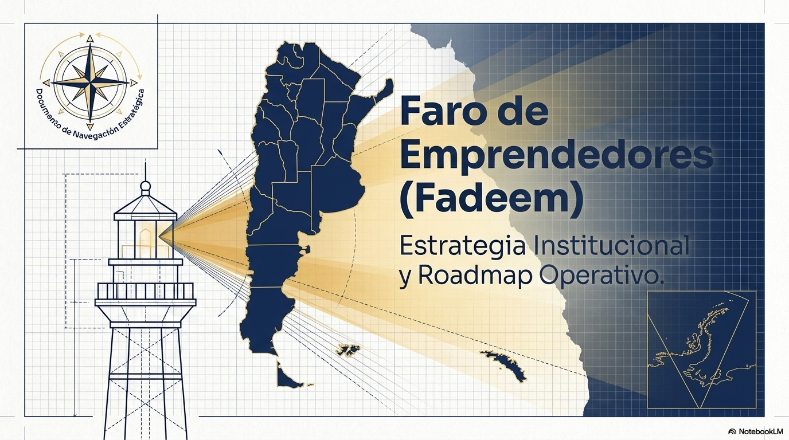
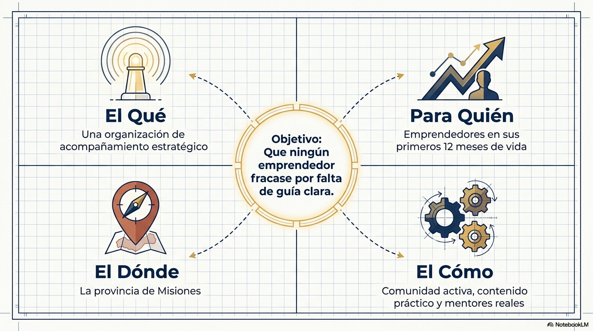
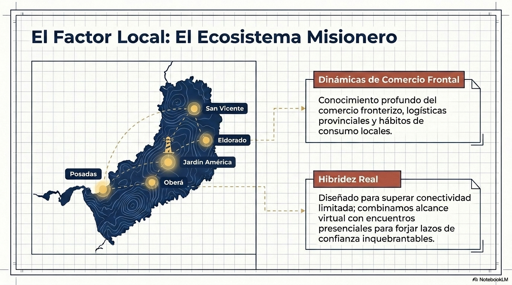
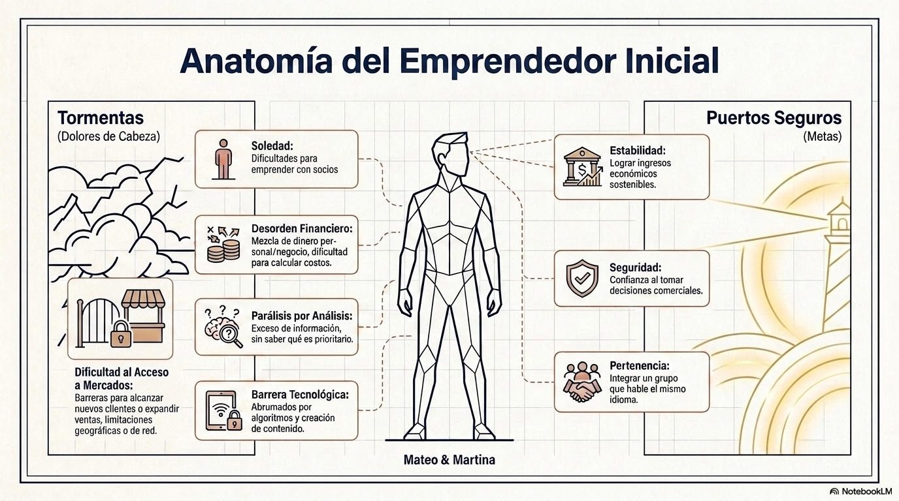
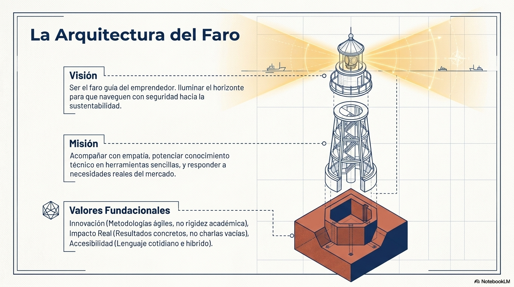
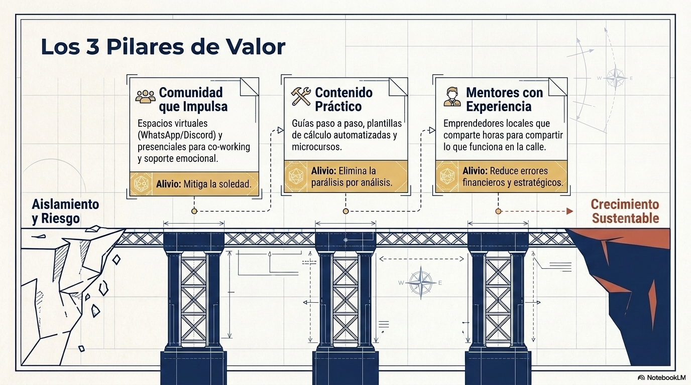
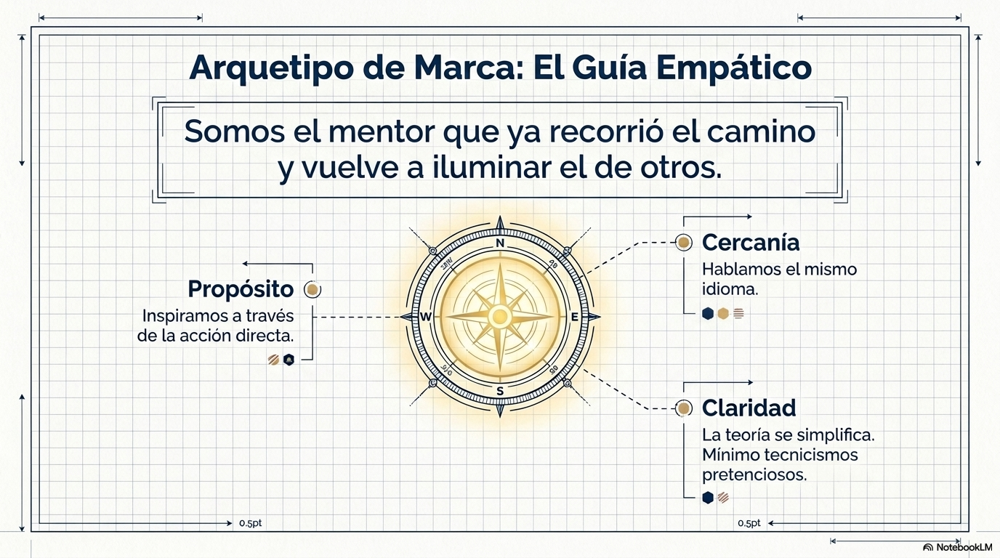
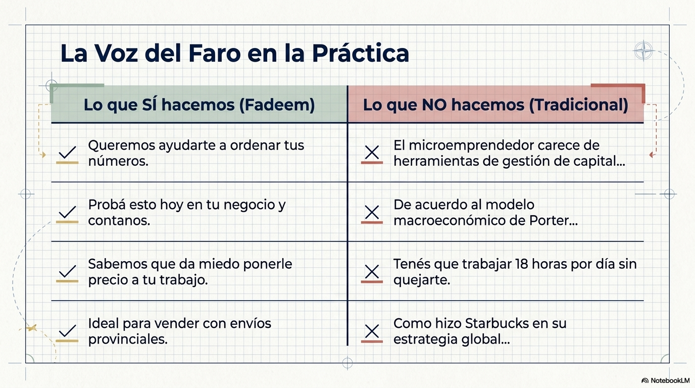
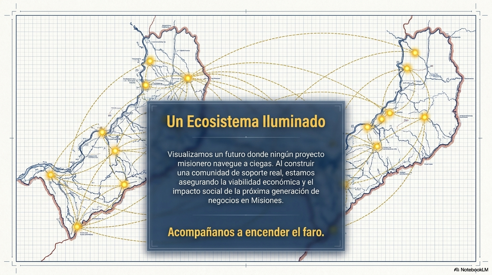

# 🔦 Faro de Emprendedores (Fadeem)

> **"Primero valor, después negocio. Construimos el faro antes de cobrar la entrada."**

Faro de Emprendedores (Fadeem) es una organización concebida para acompañar, guiar y potenciar a los emprendedores de la provincia de Misiones en sus etapas iniciales. Este repositorio contiene la base conceptual, estratégica y de identidad del proyecto para fundamentar y estructurar su crecimiento orgánico y sustentable.

---

## 🗺️ Mapa de la Documentación

Para explorar la fundamentación del proyecto, te invitamos a recorrer los siguientes documentos en orden:

1. **[01. Estrategia Institucional](./01_estrategia_institucional.md)**
   * *Misión, Visión y Valores Fundacionales.* La brújula y la luz que guía a la organización.
2. **[02. Propuesta de Valor y Audiencia](./02_propuesta_valor_y_audiencia.md)**
   * *¿A quién ayudamos y cómo?* Definición del perfil del emprendedor misionero en etapa inicial y encaje del servicio.
3. **[03. Plan Operativo y Roadmap](./03_plan_operativo_y_roadmap.md)**
   * *La hoja de ruta (0 a 18+ meses).* Plan de acción para crear comunidad, sumar mentores y escalar el impacto.
4. **[04. Identidad y Comunicación](./04_identidad_y_comunicacion.md)**
   * *Nuestra voz.* Directrices de comunicación, tono empático y cercano, y ejemplos prácticos de mensajes.
5. **[05. Modelo de Sustentabilidad](./05_modelo_de_negocio.md)**
   * *Colaboración y próximos pasos.* Aportes ad-honorem de los participantes y análisis de viabilidad futura.

---

## 🎯 Pilares del Proyecto

* **Guía y Acompañamiento:** Entendemos que el camino del emprendedor suele ser solitario y confuso. Ofrecemos orientación clara y mentores con experiencia real.
* **Comunidad Activa:** Un espacio seguro donde compartir aprendizajes, colaborar y encontrar impulso mutuo.
* **Impacto Local en Misiones:** Foco en las necesidades particulares de la región geográfica, su ecosistema y oportunidades.

---

## 🖼️ Presentación del Proyecto (Slides)

A continuación se presentan las diapositivas de la presentación oficial del proyecto (`Fadeem.pptx`):

| Diapositiva 1 | Diapositiva 2 | Diapositiva 3 |
| :---: | :---: | :---: |
|  |  |  |

| Diapositiva 4 | Diapositiva 5 | Diapositiva 6 |
| :---: | :---: | :---: |
|  |  |  |

| Diapositiva 7 | Diapositiva 8 | Diapositiva 9 |
| :---: | :---: | :---: |
|  |  |  |
